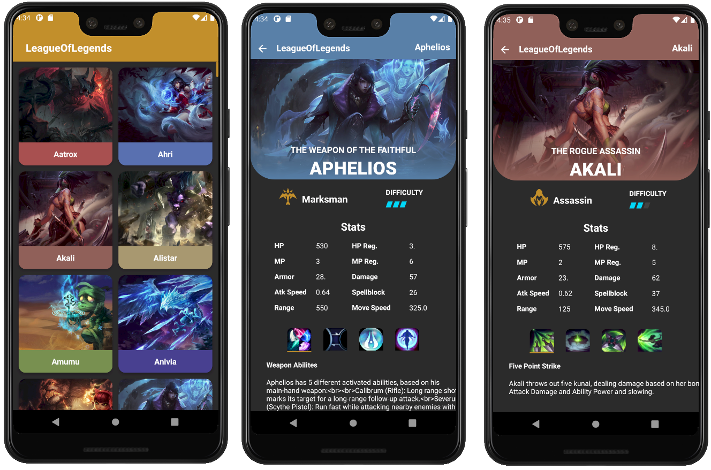

<h1 align="center">League of Legend</h1>

<p align="center">
  <a href="https://opensource.org/licenses/Apache-2.0"></a>
  <a href="https://android-arsenal.com/api?level=21"></a>
</p>

<p align="center">
League of Legends App is a small demo application based on modern Android application tech-stacks and MVVM architecture.
Also fetching data from the network and integrating persisted data in the database via repository pattern.
</p>

<p align="center">

</p>

## Tech stack & Open-source libraries
- Minimum SDK level 21
- [Kotlin](https://kotlinlang.org/) based, [Coroutines](https://github.com/Kotlin/kotlinx.coroutines) + [Flow](https://kotlin.github.io/kotlinx.coroutines/kotlinx-coroutines-core/kotlinx.coroutines.flow/) for asynchronous.
- [Koin](https://github.com/InsertKoinIO/koin) for dependency injection.
- JetPack
  - LiveData - notify domain layer data to views.
  - Lifecycle - dispose of observing data when lifecycle state changes.
  - ViewModel - UI related data holder, lifecycle aware.
  - Room Persistence - construct a database using the abstract layer.
  - Palette - A helper class to extract prominent colors from an image.
  - Databinding - Bind UI components in your layouts to data sources in your app.
- Architecture
  - MVVM Architecture (View - DataBinding - ViewModel - Model)
  - Repository pattern
- [Retrofit2 & OkHttp3](https://github.com/square/retrofit) - construct the REST APIs and paging network data.
- [Gson](https://github.com/google/gson) - A modern JSON library for Kotlin and Java.
- [Coil](https://github.com/coil-kt/coil) - loading images.
- [Timber](https://github.com/JakeWharton/timber) - logging.
- [Stetho](http://facebook.github.io/stetho/) - Http Inspector
- [Material-Components](https://github.com/material-components/material-components-android) - Material design components like ripple animation, cardView.

## Architecture
League of Legends App is based on MVVM architecture and a repository pattern.


## Open API

League of Legends App using the [LoLAPI](https://developer.riotgames.com/docs/lol#data-dragon) for constructing RESTful API.<br>
LoLAPI provides a RESTful API interface to highly detailed objects.

# License
```xml
Designed and developed by 2020 dsemprich (David Semprich)

Licensed under the Apache License, Version 2.0 (the "License");
you may not use this file except in compliance with the License.
You may obtain a copy of the License at

   http://www.apache.org/licenses/LICENSE-2.0

Unless required by applicable law or agreed to in writing, software
distributed under the License is distributed on an "AS IS" BASIS,
WITHOUT WARRANTIES OR CONDITIONS OF ANY KIND, either express or implied.
See the License for the specific language governing permissions and
limitations under the License.
```